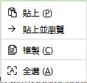
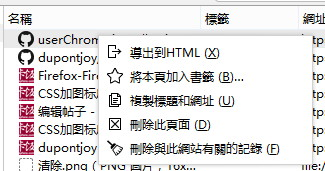

Firefox 36之後右鍵加圖標的方式有了變化，原來的方式加不上圖標，只好換用Addmenuplus來加，但加的圖標比CSS要延遲一些，所以一直都感覺有一丁點不爽。 
直到今天（2015.07.18）終於找到方法用CSS加圖標，解決了圖標與文字擠在一起的問題。

36版之後，新的加圖標方式需要加上这一句：

    -moz-binding:url("chrome://global/content/bindings/menu.xml#menuitem-iconic")!important;

解決图標和文字擠一起問題：

    /*==修正图標和文字擠一起問題==*/
    /* Adjust left-margin for menuitems and menus which aren't iconized */
    menuitem:not([type="checkbox"]):not([type="radio"]) > hbox.menu-iconic-left, menu > hbox.menu-iconic-left 
    {-moz-appearance:menuimage;}
    
現在把平時會看到的地方都補上圖標：

地址欄右鍵菜單： 

About:Config右鍵菜單： 

    
歷史右鍵菜單： 
