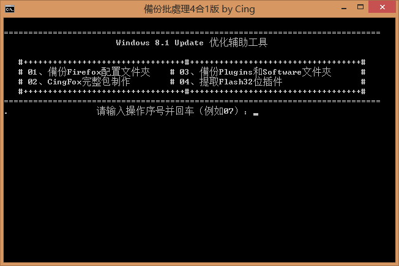
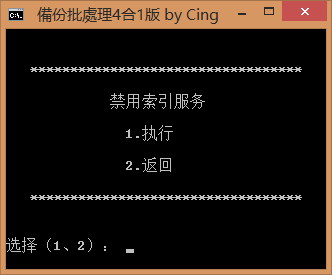
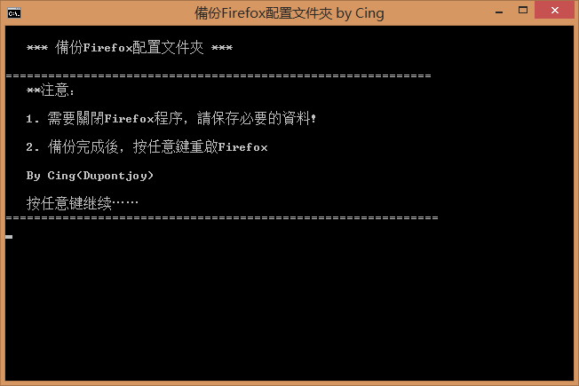
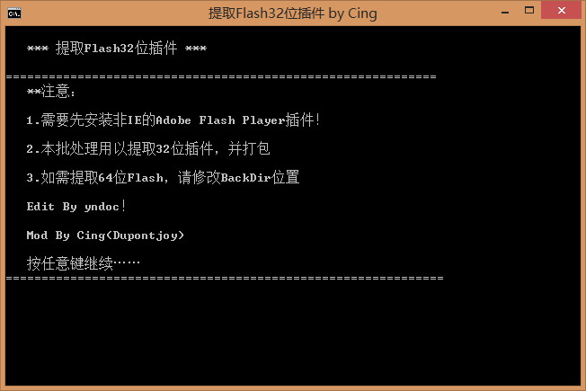
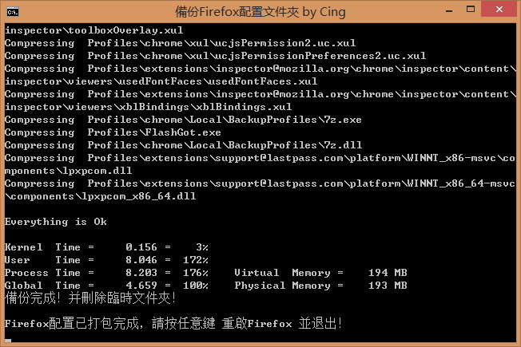
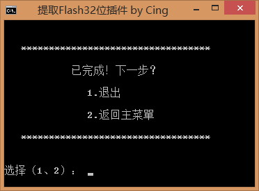
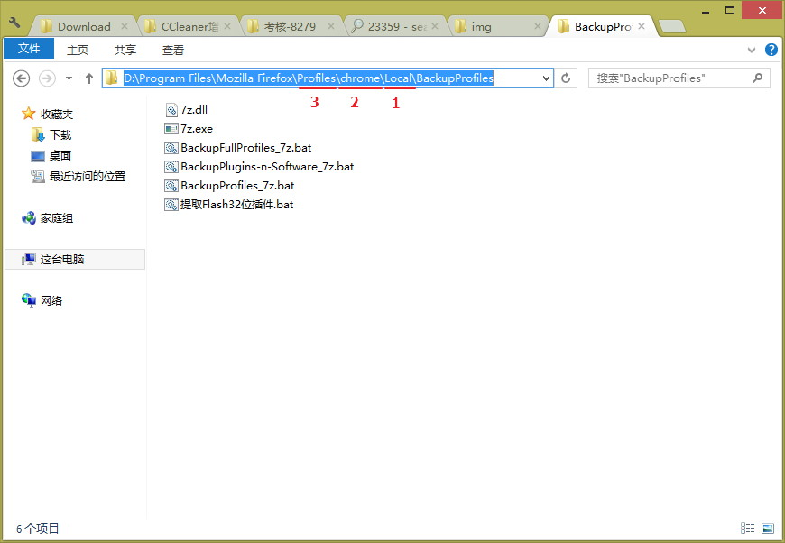
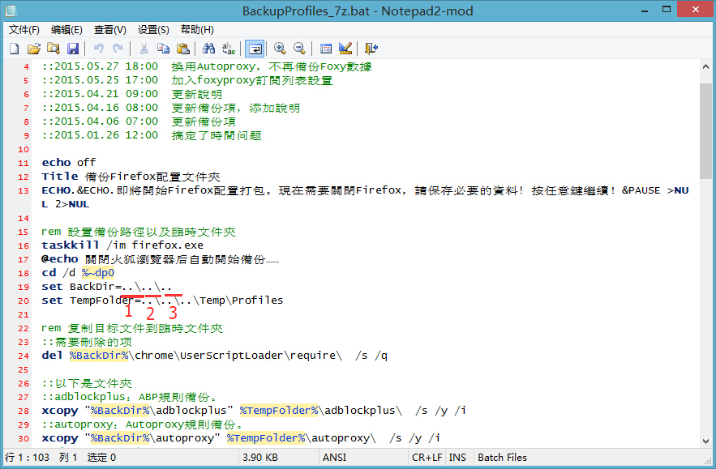
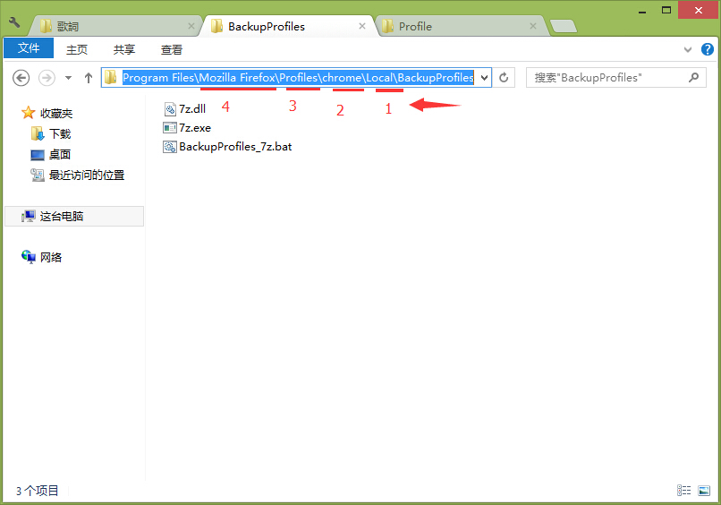
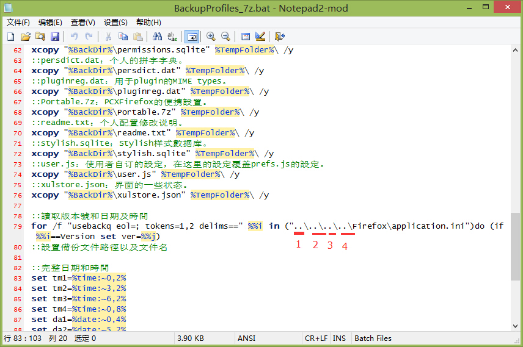

##Backup_7z整合版

Mod by **Cing**

含以下5个功能： 
- [x] 一键制作 配置包
- [x] 一键制作 完整包
- [x] 一键备份 插件和软件包
- [x] 一键提取 32位Flash插件
- [x] 備份一些文件到GitHub文件夹

**注意：**文件夹相对结构要调整好。不会调整的就只能按我的结构来了。

###特点：
- 自定义需要备份的「文件夹」和「文件」，二者表达有小差別，已分组便于查找和修改
- 添加完整的时间，支持24小時制，精确到：日期+时+分+秒。如：20150607-202728
- 支持获取Firefox版本号，配置包名称格式：名称+时间+版本。如：Profiles_20150607-202728_38.0.5.7z
- 添加备份进行之前/之后的提示语句，便于取消操作
- 备份结束后重启Firefox

###更新歷史：
- 2015.10.04 模塊化每個備份項目，然後再組合，方便修攺維護
- 2015.10.01 加入精簡擴展語言，如lastpass.jar中的語言項
- 2015.09.24 開啟7zip極限壓縮
- 2015.07.13 四个功能整合成一个文件，加入選項
- 2015.07.11 提取32位Flash插件加入選項
- 2015.07.02 添加刪除項，其它小調整
- 2015.06.25 實現獲取Flash版本號
- 2015.06.23 加入提取32位Flash插件批处理

打包开始： 

选择： 

打包结束： 

###注意：
**我的配置文件夹结构：** 

**1. 关于批处理与配置的相对位置：** 
从批处理所在位置到配置文件夹（Profiles），共跨了3层，所以批处理中会这样定义： 

**2. 关于获取Firefox版本号：** 
从批处理所在位置到Firefox程序文件夹（firefox），共跨了4层，所以批处理中会这样定义： 

| 應用實例 | |
| :--- | :--- |
| **CingFox完整包** | https://github.com/dupontjoy/userChrome.js-Collections-/tree/master/CingFox |
| **Flash32位原版提取帶vch和exe** | http://pan.baidu.com/s/1sjz92Z7 |
