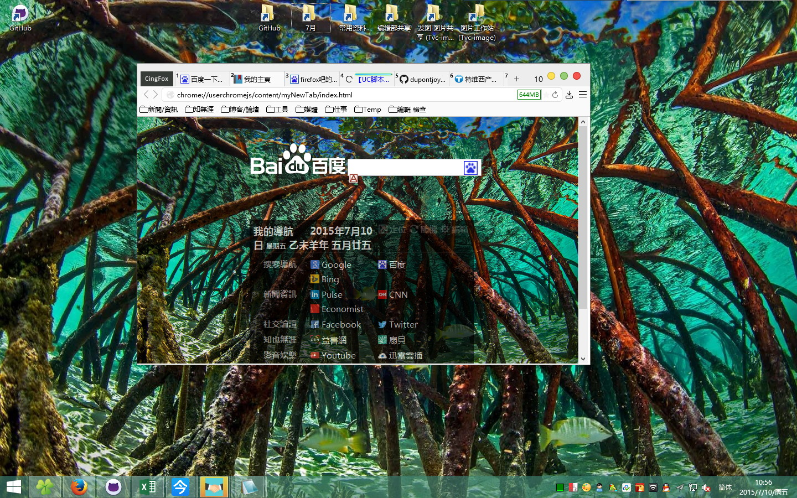

##BingDesktopThemeEveryDay.uc.js

每日必应缤纷桌面，自动同步更新桌面壁纸

by 527836355

原貼：http://tieba.baidu.com/p/2611038360

- 加入腳本表頭，對腳本進行描述，补充相關資料

`//==UserScript==
// @name         BingDesktopThemeEveryDay.uc.js
// @description  每天第一次运行Firefox，将下载Bing首页背景，并设置为系统桌面背景。每天換背景，天天好心情，哦㖿！
// @author       527836355
// @include      main
// @charset      utf-8
// @version      1.0
// @downloadURL  https://raw.githubusercontent.com/dupontjoy/userChrome.js-Collections-/master/BingDesktopThemeEveryDay/BingDesktopThemeEveryDay.uc.js
// @homepageURL  https://github.com/dupontjoy/userChrome.js-Collections-/tree/master/BingDesktopThemeEveryDay

// @note         2015.04.02 09:00 必应美图改到配置文件夹下

//==/UserScript==`

