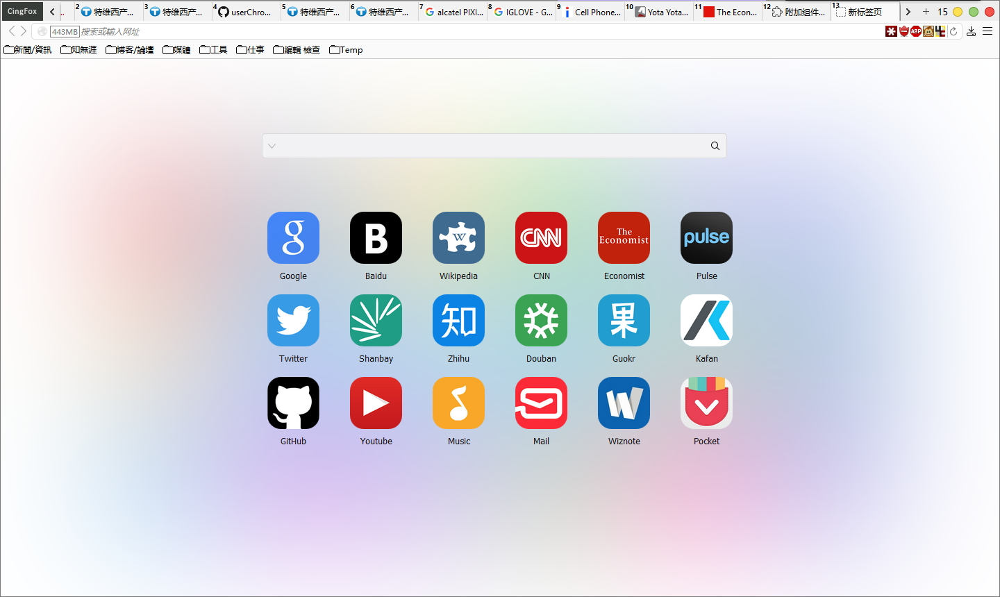
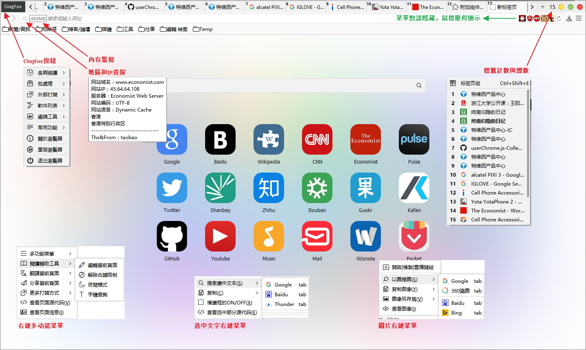
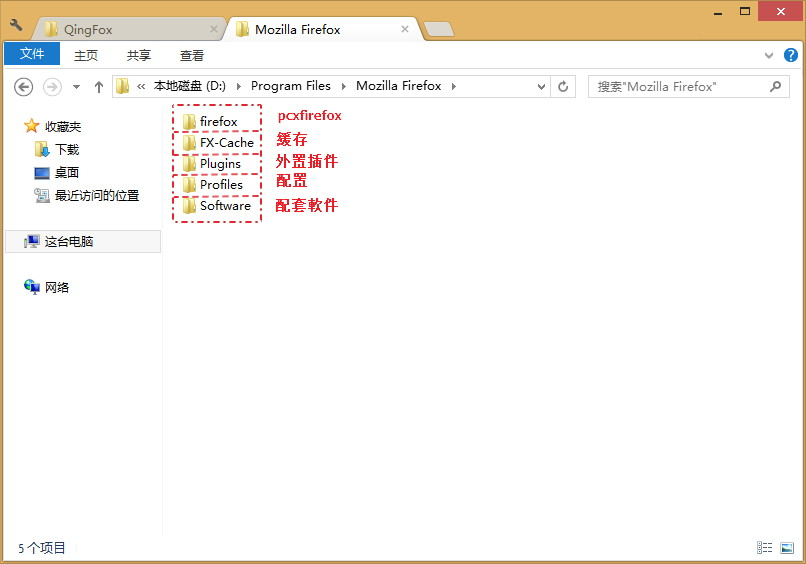

##  CingFox-20160207 (based on 44.0)

一個美觀而實用的Firefox深度定制版，在保證流畅的同時給你以Mac般的視覺享受。界面修攺自RunningCheese V5版.

主程序pcxFirefox簡體中文版，原生便攜支持，解壓即可用。

| | |
| :-- | :-- |
| 界面預覧: | 常用功能: |
|  |  |

####特色：
- 基于SimpleWhite的全新界面，如Mac般的細膩視感
- 美觀的快速拨號
- 廣告過濾：帶個人維護規則，屏蔽常用網站彈窗及色情圖片
- 百度網盤大文件直接下載
- 顯示國旗，查探IP地址和服務器地址
- ProgressbarInTab腳本，在標籤上展示加載進度條
- 豐富的redirector規則
- 詳盡整理的user.js參數
- 點擊過的鏈接灰色顯示
- 標籤计數与總數
- 文本，鏈接，圖片，文件等，展示不同的手型標識
- 極簡右鍵菜單，冗餘菜單全部隱藏
- 完善的批處理（配置和完整版打包一鍵製作）
- 配套軟件分享
- 詳細的備注說明，有心的朋友可以學到東西
- …… ……

####所用擴展：
| | |
| :--- | :--- |
| **擴展名稱** | **功能說明** |
| Adblock Plus | 去除网页广告及弹窗 |
| Adblock Plus元素隐藏 | ABP輔助，自定義規則必備 |
| DOM Inspector | 元素查看器，方便查找菜單及按鈕ID |
| DownThemAll! | 下載辅助，配合FlashGot可自動獲取引用頁 |
| FlashGot | 下载网页中的视频和音频文件 |
| Greasemonkey | 伟大的油猴子，通过JS文件增强或改变网站的功能 |
| iMacros | 解放重複性操作 |
| Lastpass | 記住你的密碼 |
| Redirector | 重定向網址, 可測試規則是否生效 |
| Simple Proxy | 一個簡約而不簡單的代理辅助擴展 |
| Stylish | 用CSS改变浏览器和网页的显示外观 |
| userChromeJS | UC腳本管理擴展 |

####文件夾結構：

- **Firefox:** pcxFirefox主程式。
- **Profiles:** 完整配置文件夾。
- **Plugins:** 便攜dll提取版插件。含個人提取的Flash32位，工行等插件。
- **Software:** 配套軟件。含一些FQ軟件（賬號不提供），Notepad2編輯器（[設爲默認的方法](https://github.com/dupontjoy/userChromeJS/blob/master/SubScript/setRelativeEditPath.uc.js)）和截圖軟件。

####說明：
- 直接运行firefox文件夹中的firefox.exe即可。
- 請仔细看user.js中參數的说明，酌情删减。
- 配套軟件都采用相对路径，请严格按照如下文件夹结构使用。会修改的朋友，可以自定义。
- 界面基于Win10設置，部分CSS值需要修改以適配其它系統。

####個人Firefox經歷：
自2008年Firefox 2.0開始使用Firefox，這麼多年下來，也積累了豐富的使用經驗。雖然不太懂代碼，但是因爲有一顆不怕折騰的心，折騰過擴展，油猴腳本，UC腳本，CSS樣式，正則規則，批處理等等。

####參考資料：
- 官方原版FTP：http://ftp.mozilla.org/pub/mozilla.org/firefox/releases/
- pcxFirefox主程式：http://sourceforge.net/projects/pcxfirefox/files/Release/Firefox/
- RunningCheese：http://www.runningcheese.com/
- Aunsen盒子版：http://bbs.kafan.cn/thread-1704664-1-1.html
- KingTung：http://www.firefoxfan.com/
- Y大：https://github.com/ywzhaiqi/userChromeJS
- Feiruo：https://github.com/feiruo/userChromeJS
- Drager-oos：https://github.com/Drager-oos/userChrome
- alice0775：https://github.com/alice0775/userChrome.js
- DannyLee：http://g.mozest.com/thread-43513-1-1
- Redirector腳本版 by cinhoo：http://bbs.kafan.cn/thread-1621837-1-1.html
- Google开源库重定向到国內：http://bbs.kafan.cn/thread-1769934-1-1.html
- SimpleProxy扩展：https://github.com/jc3213/SimpleProxy
- …… ……

| | |
| :--- | :--- |
| **長期下載地址** | 链接:http://pan.baidu.com/s/1gepIhKv#r8di |
|  | 問題反饋: http://bbs.kafan.cn/thread-1792671-1-1.html |
| Chrome文件夾(UC腳本集) | https://github.com/dupontjoy/userChromeJS/ |
| Flash32位原版提取帶vch和exe | http://pan.baidu.com/s/1sjz92Z7 |
| Backup_7z備份批處理 | [BackupProfiles_7z](../BackupProfiles_7z) |
| 維護的規則列表 | [ABP](https://github.com/dupontjoy/customization/raw/master/Rules/ABP/Floating-n-Porn-Ads-Filter.txt) |
