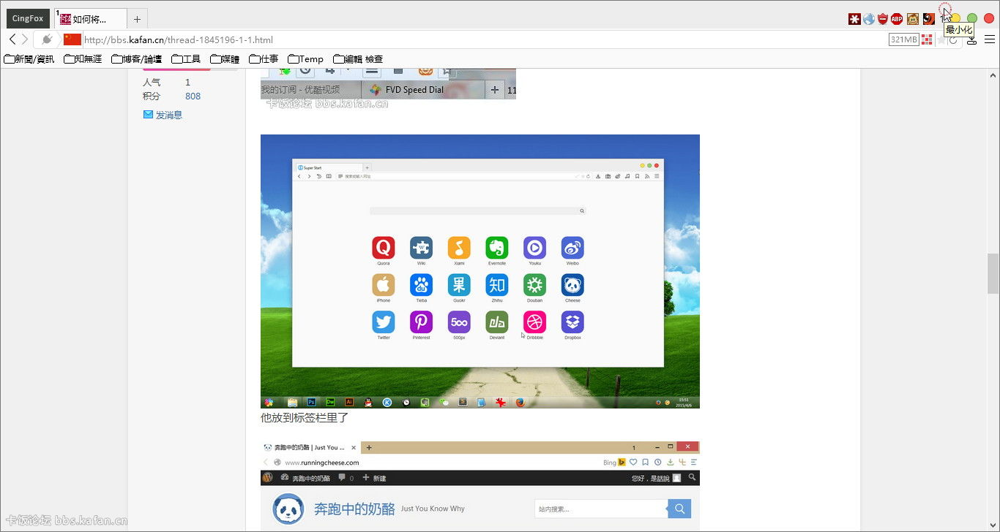

##CingFox

**Mod by Cing**

**個人Firefox配置完整打包**，基於pcxFirefox繁體中文版

自2008年Firefox 2.0開始使用Firefox，這麼多年下來，也積累了豐富的使用經驗。雖然不太懂代碼，但是因爲有一顆不怕折騰的心，折騰過擴展，油猴腳本，UC腳本，CSS樣式，正則規則，批處理等等。

本作界面基於[RunningCheese V5版](http://bbs.kafan.cn/thread-1821447-1-1.html)，使用的是Simple White主題+Yosemite樣式，整體界面清新自然，簡約時尚。(Yosemite樣式用Stylish擴展引導）

其馀擴展，腳本，和[樣式](https://github.com/dupontjoy/userChromeJS/tree/master/UserCSSLoader)（用[userCSSLoader.uc.js](https://github.com/dupontjoy/userChromeJS/blob/master/UCJSFiles/UserCSSLoader_ModOos.uc.js)引導）都是幾年下來不斷蒐集，小調整而來。

便攜版插件（Plugins）含：[個人提取的Flash32位](https://github.com/dupontjoy/userChrome.js-Collections-/tree/master/BackupProfiles_7z)，工行，CNTV，SumatraPDF等插件。

配置軟件（Software）含：一些FQ軟件（賬號不提供），Notepad2編輯器（[設爲默認的方法](https://github.com/dupontjoy/userChromeJS/blob/master/userContent/setRelativeEditPath.uc.js)）和截圖軟件。都是和Firefox息息相關的，其它不必要的軟件都不再打包。

###界面預覧：

####注意：
（頂部請保留足夠间距 ↓） 
奶酪是把系统的三个按钮隐藏了，然后又新做了3个按钮，由于原来的按钮还在原来的位置，光标移动到相应位置，还是可以最小化/最大化/关闭 操作的。所以需要把标签上边的空隙留的较大，就是为了防止误操作。 

####特色功能：
（左上角Logo ↓） 

（标签计数 ↓） 

（标签加载进度条 ↓） 

（文件夹結构 ↓） 

####各類右鍵菜單
（標籤右鍵菜單 ↓） 

（頁面右鍵菜單 ↓） 

（鏈接和選中文字右鍵菜單 ↓） 

（輸入框右鍵菜單 ↓） 

（圖片右鍵菜單 ↓） 

（書籤右鍵菜單 ↓） 

| | |
| :--- | :--- |
| **詳細說明及發佈地址** | http://bbs.kafan.cn/thread-1792671-1-1.html |
| SF Project | https://sourceforge.net/projects/qingfox/ |
| Chrome文件夾(UC腳本集) | https://github.com/dupontjoy/userChromeJS/ |
