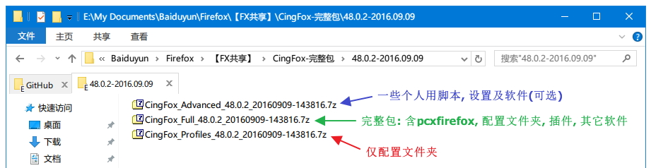

##  CingFox

based on [pcxFirefox](http://sourceforge.net/projects/pcxfirefox/files/Release/Firefox/)

一個美觀而實用的Firefox深度定制版, 在保證流畅的同時給你以Mac般的視覺享受. 
界面修攺自RunningCheese V5版. 
正常來说计划**每周五**更新一次, 希望能坚持尽量地久. 每次发布含3个压缩包, 一般而言下载Full即可.

###更新历史
- [**CingFox-48.0.2-2016.09.09**](doc/release/48.0.2-2016.09.09.md)
- [**CingFox-48.0.2-2016.09.02**](doc/release/48.0.2-2016.09.02.md)
- [**CingFox-48.0.2-2016.08.26**](doc/release/48.0.2-2016.08.26.md)
- [**CingFox-48.0.1-2016.08.20**](doc/release/48.0.1-2016.08.20.md)
- [**CingFox-47.0.1-2016.08.19**](doc/release/47.0.1-2016.08.19.md)
- [**CingFox-47.0.1-2016.07.05**](doc/release/47.0.1.md)

###特色：
- 基于SimpleWhite的全新界面, 如Mac般的細膩視感
- 美觀的快速拨號
- 廣告過濾：帶個人維護規則, 屏蔽常用網站彈窗及色情圖片
- 顯示國旗, 查探IP地址和服務器地址
- ProgressbarInTab腳本, 在標籤上展示加載進度條
- 豐富的redirector規則
- 詳盡整理的user.js參數
- 點擊過的鏈接灰色顯示
- 標籤计數与總數
- 文本, 鏈接, 圖片, 文件等, 展示不同的手型標識
- 極簡右鍵菜單, 冗餘菜單全部隱藏
- 完善的批處理（配置和完整版打包一鍵製作）
- 配套軟件分享
- 詳細的備注說明, 有心的朋友可以學到東西
- …… …… 更多內容等待你去发现

###你可能还需要了解

| | | |
| :--- | :--- | :--- |
| [文件夹结构](doc/how-to/文件夹结构.md) | [所用扩展简介](doc/how-to/所用扩展简介.md) | [user.js的设置](doc/how-to/user.js.md) | 
| [VimFx的用法](doc/how-to/vimfx用法.md) | [about:newtab网址及图标](doc/how-to/about-newtab.md) | [searchplugins设置](doc/how-to/searchplugins.md) |
| [uBlock Origin第三方设置](doc/how-to/ubo.md) | [个人Firefox经历](doc/how-to/个人Firefox经历.md) |  |

###參考資料：
- 官方Firefox：http://ftp.mozilla.org/pub/mozilla.org/firefox/releases/
- pcxFirefox：http://sourceforge.net/projects/pcxfirefox/files/Release/Firefox/
- RunningCheese：http://www.runningcheese.com/
- 阳光盒子：http://sunbox.cc/
- Y大：https://github.com/ywzhaiqi/userChromeJS
- Feiruo：https://github.com/feiruo/userChromeJS
- alice0775：https://github.com/alice0775/userChrome.js
- Redirector腳本版 by cinhoo：http://bbs.kafan.cn/thread-1621837-1-1.html
- Google开源库重定向到国內：http://bbs.kafan.cn/thread-1769934-1-1.html
- ……