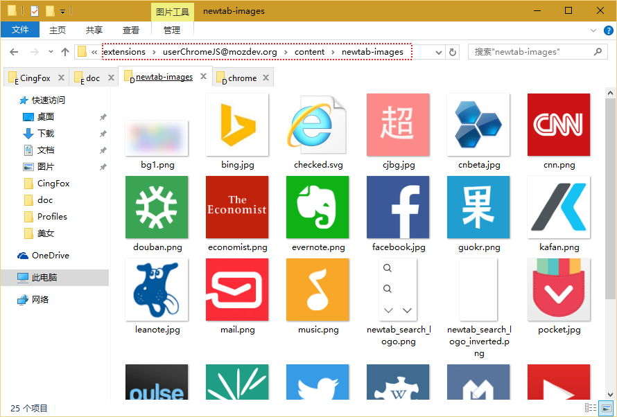
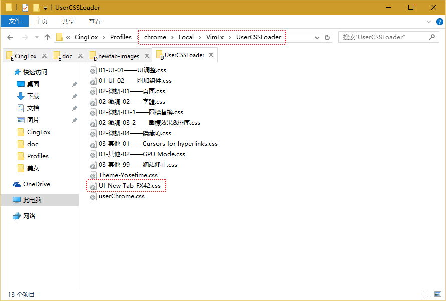

####about:newtab设置

预览图:


想要将about:newtab设置成以上效果, 你需要按照下述步骤来设置.

####将如下参数写入user.js中

```javascript
user_pref("browser.startup.homepage", "about:newtab");//首頁
user_pref("browser.newtabpage.columns", 6);//新标签页列数
user_pref("browser.newtabpage.rows", 3);//新标签页行数
//标签页固定的网站
user_pref("browser.newtabpage.pinned", "[{\"url\":\"http://bbs.kafan.cn/forum-215-1.html\",\"title\":\"Kafan\"},{\"url\":\"https://www.youtube.com/\",\"title\":\"Youtube\"},{\"url\":\"http://www.cnn.com/\",\"title\":\"CNN\"},{\"url\":\"http://www.economist.com/\",\"title\":\"Economist\"},{\"url\":\"http://twitter.com/\",\"title\":\"Twitter\"},{\"url\":\"http://www.facebook.com/\",\"title\":\"Facebook\"},{\"url\":\"http://www.chaojibiaoge.com/\",\"title\":\"超级表格\"},{\"url\":\"http://www.cnbeta.com/\",\"title\":\"cnBeta\"},{\"url\":\"http://www.woshipm.com/\",\"title\":\"pm\"},{\"url\":\"http://www.douban.com/\",\"title\":\"Douban\"},{\"url\":\"http://www.zhihu.com/explore\",\"title\":\" Zhihu\"},{\"url\":\"http://www.guokr.com/\",\"title\":\"Guokr\"},{\"url\":\"https://www.wikipedia.org/\",\"title\":\"Wikipedia\"},{\"url\":\"http://www.linkedin.com/today/?trk=nav_responsive_sub_nav_pulse\",\"title\":\"Pulse\"},{\"url\":\"http://www.shanbay.com/\",\"title\":\"Shanbay\"},{\"url\":\"http://music.163.com/\",\"title\":\"Music\"},{\"url\":\"http://email.163.com/\",\"title\":\"Mail\"},{\"url\":\"https://leanote.com/note/55dd7cc953b26f7350000019\",\"title\":\"Leanote\"}]");
```

共需要6x3=18个网址及图标, 网址格式参照已有的来改, 顺序也是这条参数中固定死的. 最好先在记事本中一条网址写一行, 方便调顺序, 最后再将所有网址合并成一行展示.

####找图标或PS图标

建议图标大小152x152, 做好后放入

```javascript
ProfD\extensions\userChromeJS@mozdev.org\content\newtab-images
```



####安装Simple White主题
由于样式是搭配Simple White主题使用的, 所以...

https://addons.mozilla.org/zh-CN/firefox/addon/simplewhite/?src=search

####使用Stylish或VimFx加载样式
!注意, 有些样式使用userCSSLoader.uc.js加载是不行的, about:newtab的样式即是如此.


