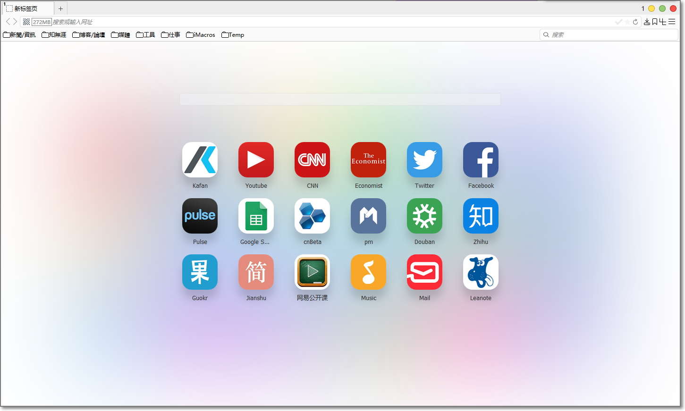
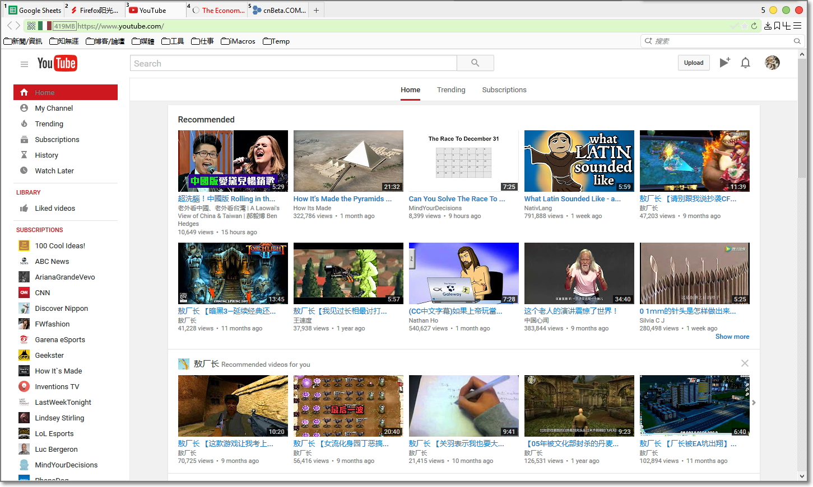

##  CingFox-48.0.2-2016.09.02

###近期更新
####样式
- 优化: 换用Defpt大大的侧栏隐藏版本并稍作修改, 开启侧栏后左上角会有个圆点
- 优化: 修复附加组件栏的错位
- 新增: Cat兄的字体替換样式

####扩展
- 优化: 201604版Aup_Mod有bug, 不能添加规则, 換回旧版
- 优化: UBO还是有些不可测的Bug, 換回ABP+EHH的组合
- 优化: 添加VimFX的EHH调用快捷键<kbd>,e</kbd>; VimFx按键默认值又变了:<kbd>j</kbd>变为了向下滚动, <kbd>k</kbd>变为了向上滚动

####脚本
- 优化: 加入批量复制链接URL功能及批量复制图片URL功能(Addmenu)
- 优化: 整合skofkyo的referchange规则
- 优化: Redirector规则google字体重定向到科大(360的最近载入巨慢)
- 优化: 更新skofkyo的Stylish辅助脚本

###界面预览

| | |
| :-- | :-- |
|  |  |
|  |  |

###下载与安装

| |  |
| :-- | :-- |
| **下載地址** | 链接: https://pan.baidu.com/s/1qYxT8sO 密码: jp29 |

下载说明:
- 下载的压缩包最好保留, 万一Firefox出现问题, 可以重新解压.
- 主程序pcxFirefox原生便攜支持, 点击"Firefox\firefox.exe"即可启动.
- 請仔细看user.js中參數的说明, 酌情删减.
- 配套軟件都采用相对路径, 请勿移动位置. 会修改的朋友, 可以自定义.
- 界面基于Win10設置, 部分CSS值需要修改可以適配其它系統.

###通用教程

[**你可能还需要了解**](../..#你可能还需要了解)