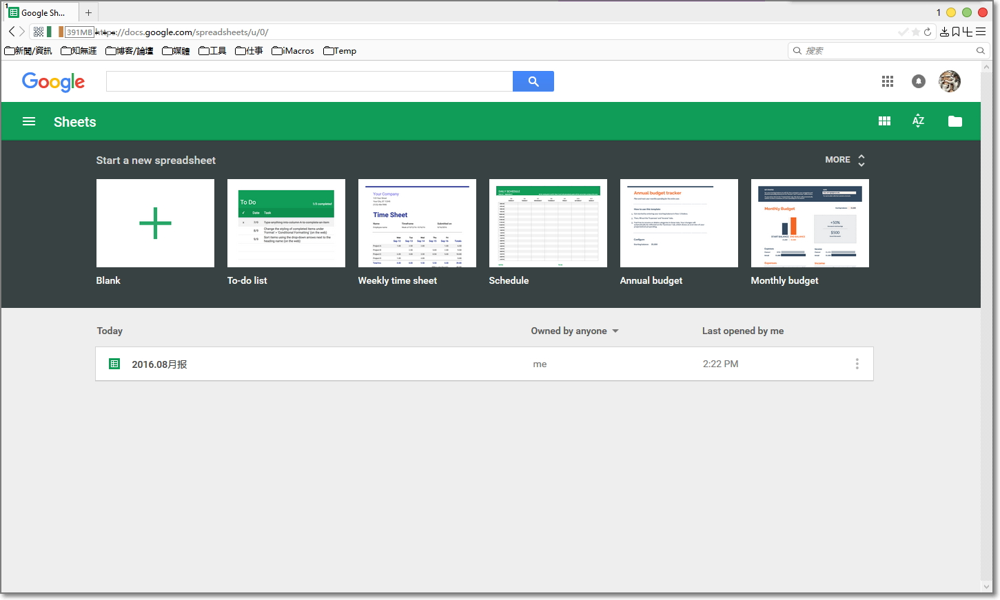
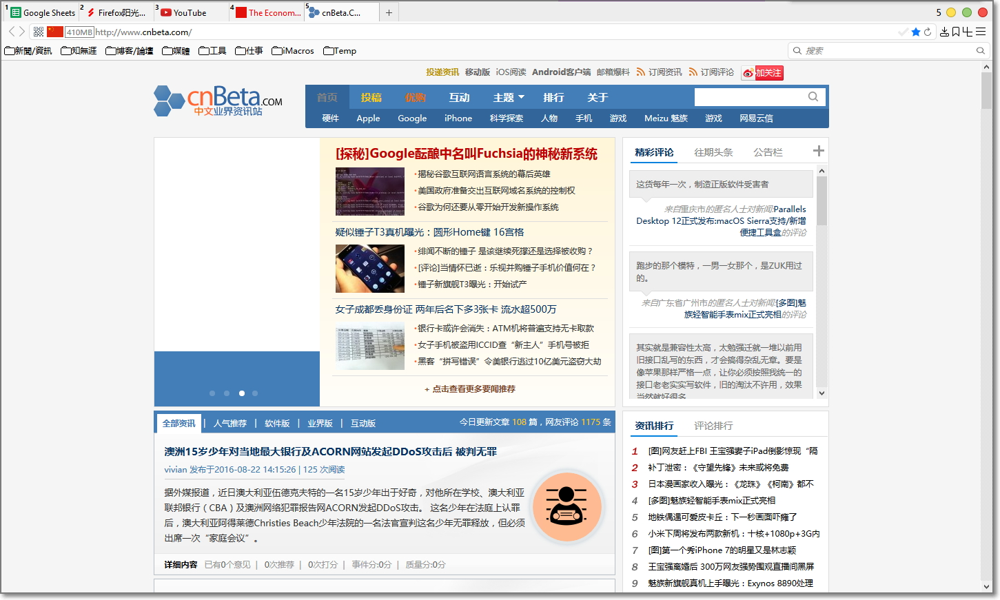

##  CingFox-48.0.2-2016.09.09

###近期更新
####脚本
- 优化: Google字体回归北京, 360库停止服务, 所以fonts不再重定向, ajax重定向到科大
- 优化: 几个脚本分开打包(包括user.js, Redirector, sougoupic等)

####样式:
- 优化: 去除颜太吓的工具栏通用CSS(图标间距压缩)
- 优化: 悬浮字体颜色只作用于页面

###界面预览

| | |
| :-- | :-- |
|  |  |
|  |  |

###下载与安装

| |  |
| :-- | :-- |
| **下載地址** | 链接: https://pan.baidu.com/s/1slvkdNv 密码: 7q98 |

下载说明:
- 下载的压缩包最好保留, 万一Firefox出现问题, 可以重新解压.
- 主程序pcxFirefox原生便攜支持, 点击"Firefox\firefox.exe"即可启动.
- 請仔细看user.js中參數的说明, 酌情删减.
- 配套軟件都采用相对路径, 请勿移动位置. 会修改的朋友, 可以自定义.
- 界面基于Win10設置, 部分CSS值需要修改可以適配其它系統.

###通用教程

[**你可能还需要了解**](../..#你可能还需要了解)