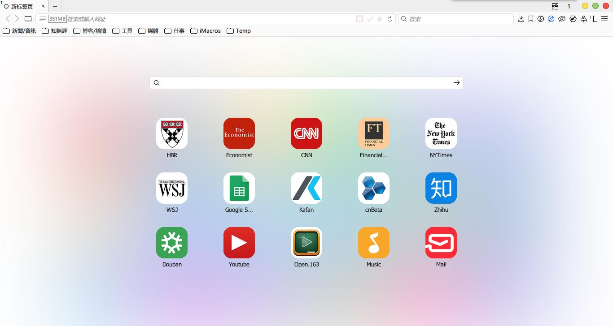
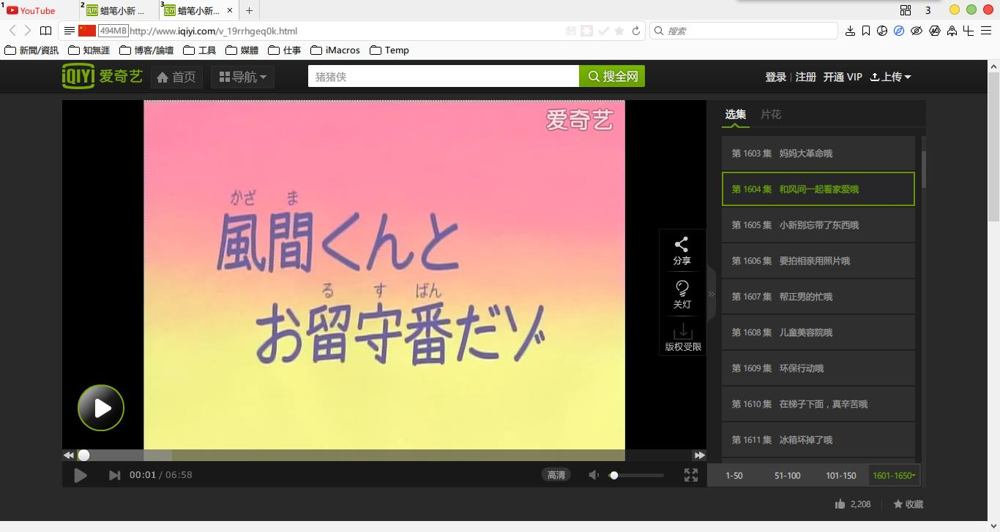

## 

###近期更新

####样式:
- !修正: 菜单图标问题

####脚本:
- *更新: 批处理打包逻辑变更
- !修正: 优化微信反盗链规则
- !修正: Cache2文件夹位置
- !修正: 优化Addmenu规则

####其它:
- !新增: TC和Listary两大神级软件(可选)

###界面预览

| | |
| :-- | :-- |
|  |  |
|  |  |

###下载与安装

| |  |
| :-- | :-- |
| **下載地址** | 链接: https://pan.baidu.com/s/1bBNpF4 密码: ksnn |

下载说明:
- 下载的压缩包最好保留, 万一Firefox出现问题, 可以重新解压.
- 主程序pcxFirefox原生便攜支持, 点击"Firefox\firefox.exe"即可启动.
- 請仔细看user.js中參數的说明, 酌情删减.
- 配套軟件都采用相对路径, 请勿移动位置. 会修改的朋友, 可以自定义.
- 界面基于Win10設置, 部分CSS值需要修改可以适配其它系統.
- 注意: 千万不要刪除VimFx这个扩展!!!(所有CSS样式都用此扩展引导)

###通用教程

[**你可能还需要了解**](../..#你可能还需要了解)