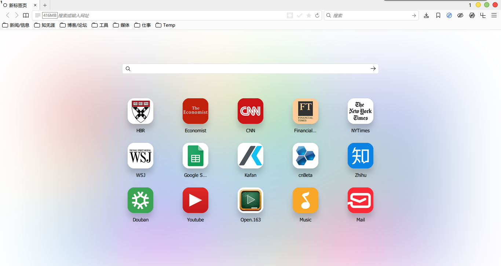
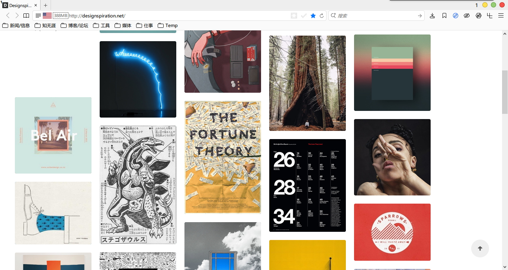

## 

###近期更新

####样式:
- !修正: 修正繁转简导致菜单未对齐问题
- *更新: Lastpass 4.x版菜单隐藏
- !修正: 国旗图标有时模糊问题

####脚本:
- -删除: ProgressinTab脚本,会导致53版标题为空白
- *更新: 部分Redirector规则
- -删除: 部分GM脚本,感觉删除后卡顿现象有所缓解

####扩展:
- *更新: Autoproxy和FoxyProxy在53版有问题,换用SimpleProxy
- +新增: DisConnect,希望对卡顿有改善

####其它:
- *更新: pcxFirefox至53.0.3
- -删除: 一些user.js参数,减少负优化

###界面预览

| | |
| :-- | :-- |
|  |  |
|  |  |

###下载与安装

| |  |
| :-- | :-- |
| **下載地址** | 链接: https://pan.baidu.com/s/1c1XzeQs 密码: qnh3 |

下载说明:
- 下载的压缩包最好保留, 万一Firefox出现问题, 可以重新解压.
- 主程序pcxFirefox原生便攜支持, 点击"Firefox\firefox.exe"即可启动.
- 請仔细看user.js中參數的说明, 酌情删减.
- 配套軟件都采用相对路径, 请勿移动位置. 会修改的朋友, 可以自定义.
- 界面基于Win10設置, 部分CSS值需要修改可以适配其它系統.
- 注意: 千万不要刪除VimFx这个扩展!!!(所有CSS样式都用此扩展引导)

###通用教程

[**你可能还需要了解**](../..#你可能还需要了解)