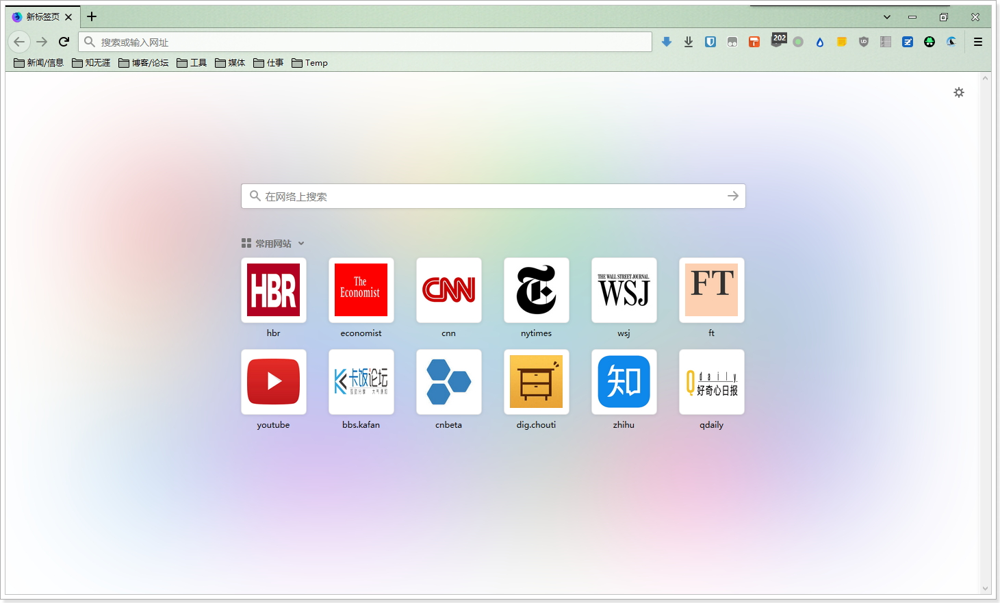
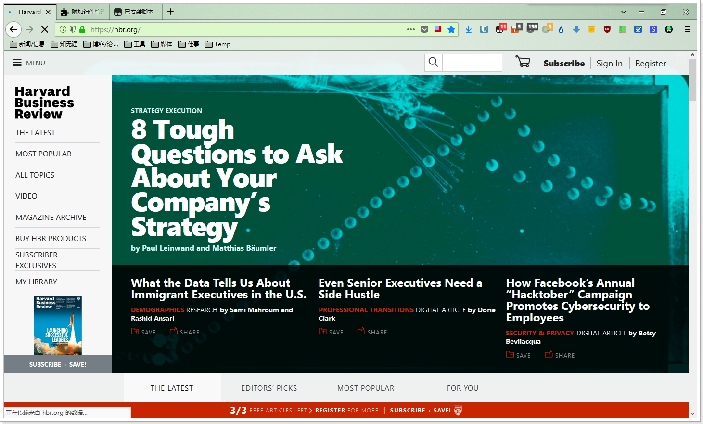
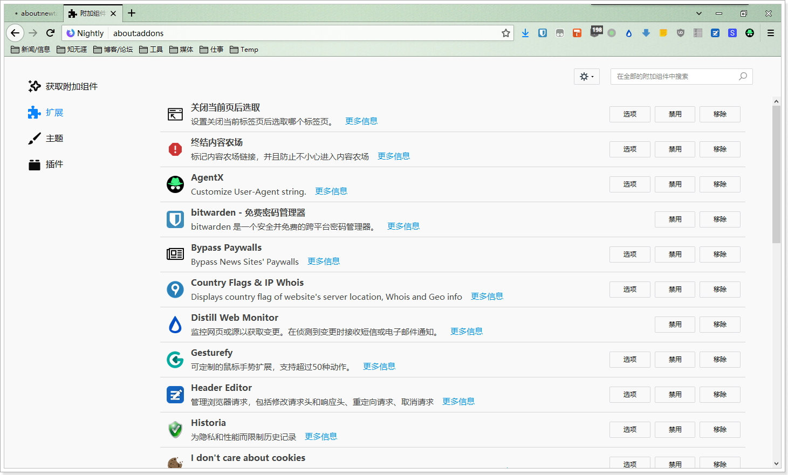
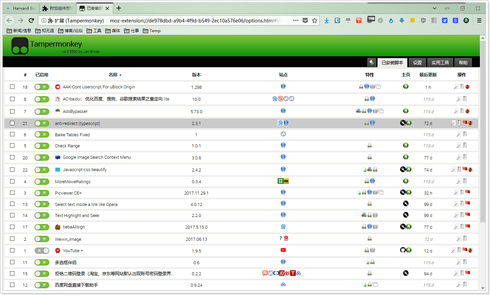

## 

### 近期更新

#### 其它

不知道更新了啥, 好像有那么一些变化.

### 界面预览

| | |
| :-- | :-- |
|  |  |
|  |  |

### 下载与安装

| |  |
| :-- | :-- |
| **下載地址** | 链接: https://pan.baidu.com/s/1c1XzeQs 密码: qnh3 |

下载说明:
- 下载的压缩包最好保留, 万一Firefox出现问题, 可以重新解压.
- 使用myfirefox引导. 请运行"**run/CingQuantum.exe**".
- 請仔细看user.js中參數的说明, 酌情删减.
- 配套軟件都采用相对路径, 请勿移动位置. 会修改的朋友, 可以自定义.

### 通用教程

[**你可能还需要了解**](../..#你可能还需要了解)
