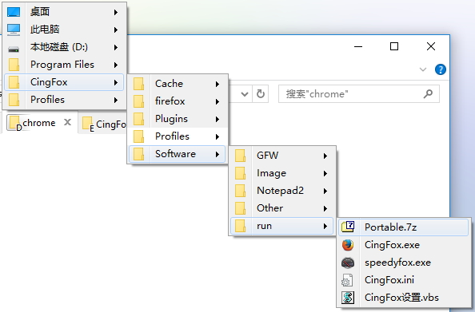

####文件夾結構：

| 文件夹层级:                                   | 如何运行:                                |
| :--------------------------------------- | :----------------------------------- |
|  |  |

- **Firefox:** pcxFirefox主程式。
- **Profiles:** 完整配置文件夾。
- **Plugins:** 便攜dll提取版插件。含個人提取的Flash32位，工行等插件。
- **Software:** 配套軟件。含一些FQ軟件（賬號不提供），Notepad2編輯器（[設爲默認的方法](https://github.com/dupontjoy/userChromeJS/blob/master/SubScript/setRelativeEditPath.uc.js)）和截圖軟件。