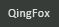

##QingFox

個人Firefox配置完整打包作爲分享給其他互聯網用戶使用

自2008年Firefox 2.0開始使用Firefox，這麼多年下來，也積累了豐富的使用經驗。雖然不太懂代碼，但是因爲有一顆不怕折騰的心，折騰過擴展，油猴腳本，UC腳本，CSS樣式，正則規則，批處理等等。

本作界面基於[RunningCheese V5版](http://bbs.kafan.cn/thread-1821447-1-1.html)，使用的是Simple White主題+Yosemite樣式，整體界面清新自然，簡約時尚。

**Mod by Qing**

###界面預覧：

###特色功能：

（标签计数↓）

（标签加载进度条 ↓）

（文件夹結构 ↓）

[詳細說明及發佈地址](http://bbs.kafan.cn/thread-1792671-1-1.html)

[SF Project](https://sourceforge.net/projects/qingfox/)
