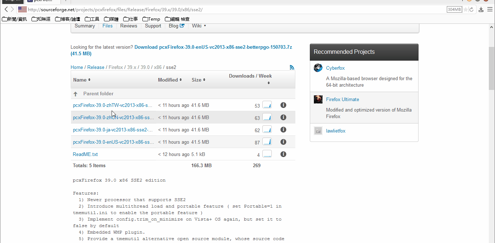

##Redirector.uc.js及規則
Script create by **[cinhoo][1]** 参照Redirector扩展和AdBlock Plus扩展创作此神级腳本 
Script mod by **[Oos][2]** 完善按钮与菜单切换版 
**個人規則：** https://github.com/dupontjoy/userChromeJS/blob/master/Local/_redirector.js 

###示例：
示例：鳳凰網 只顯示首圖修正 
http://news.ifeng.com/a/ydzx/20150413/43541233_0.shtml 重定向到 http://news.ifeng.com/a/20150413/43541233_0.shtml

    {
      //方法來源：http://tieba.baidu.com/p/3699558655
      name: "鳳凰網 只顯示首圖修正",
      from: /^https?:\/\/(.*)\.ifeng\.com\/a\/(ydzx|)\/(.*)/i,
      to: "http://$1.ifeng.com/a/$3",
      regex: true
    },

示例：userscripts >> webextender鏡像

http://userscripts.org/ 和 http://userscripts.org:8080/ 都重定向到 http://www.webextender.net/

    {
     //userscripts.org和userscripts.org:8080都重定向到webextender.net
     name: "userscripts >> webextender鏡像",
     from: /^https?:\/\/userscripts\.org(?:\:8080|)\/(.*)/i,
     to: "http:\/\/webextender.net/$1",
     regex: true
    },

示例：sourceforge下載 >> 鏡像站點 
http://sourceforge.net/projects/pcxfirefox/files/Release/Firefox/39.x/39.0/x86/sse2/pcxFirefox-39.0-zhTW-vc2013-x86-sse2-betterpgo-150703.7z/download 重定向到 http://master.dl.sourceforge.net/project/pcxfirefox/Release/Firefox/39.x/39.0/x86/sse2/pcxFirefox-39.0-zhTW-vc2013-x86-sse2-betterpgo-150703.7z

    {
     //在這樣的頁面點擊，就直接弹下載窗口
     //測試：http://sourceforge.net/projects/pcxfirefox/files/Release/Firefox/36.x/36.0.1/x86/sse2/
     name: "sourceforge下載 >> 鏡像站點",
     from: /^https?:\/\/sourceforge\.net\/projects\/(((\w)\w).*)\/files\/(.*)\/download/i,
     to: "http://master.dl.sourceforge.net/project/$1/$4",//這個源速度眞快
     //to: "ftp://ftp.jaist.ac.jp/pub/sourceforge/$3/$2/$1/$4",
     //to: "http://softlayer-sng.dl.sourceforge.net/project/$1/$4",
     regex: true
    },
    

示例：重定向12306的js到修改版

    {
     //重定向12306的js到修改版，用來定時刷票，但驗證碼得手動輸入。
     //方法來源：http://bbs.kafan.cn/thread-1809903-1-1.html
     name: "12306重定向JS",
     from: /(.*)kyfw\.12306\.cn\/otn\/resources\/merged\/queryLeftTicket_end_js.js(.*)/i,
     to: "https://raw.githubusercontent.com/dupontjoy/customization/master/12306/queryLeftTicket_end_js.js",
     regex: true
    },
    

示例：重定Google公共库到useso

    {
     name: "ajax|fonts(https?) >> useso",
     from: /^https?:\/\/(ajax|fonts)\.googleapis\.com\/(.*)$/,
     to: "http://$1.useso.com/$2",
     regex: true
    },

由于HTTPS不允许HTTP的混合內容，HTTPS重定向到useso按理是不行的，也就是很多人说useso不支持HTTPS的原因。其实Firefox用戶可以通过修改以下两条参数，禁用SSL保护，使得HTTPS下可以载入HTTP的混和內容，那么HTTP和HTTPS就都可以重定向到useso了：

    //HTTPS不允许混合内容，以下两条参数用以禁用此特性
    user_pref("security.mixed_content.block_active_content", false);
    user_pref("security.mixed_content.block_display_content", false);
    
示例：Google搜天氣時 圖標

    {
     //來源：http://bbs.kafan.cn/thread-1824493-1-1.html
     name: "Google搜天氣時 圖標",
     from: /^https?:\/\/www\.gstatic\.cn\/onebox\/weather\/(.*)/i,
     to: "https://ssl.gstatic.com/onebox/weather/$1",
     regex: true
    },

示例：重定向公共库

    {
     //参考：https://servers.ustclug.org/2014/06/blog-googlefonts-speedup/
     name: "ajax|fonts(https) >> 科大",
     from: /^https:\/\/(ajax|fonts)\.googleapis\.com\/(.*)$/,
     to: "https://$1.lug.ustc.edu.cn/$2",
     regex: true
    },
    {
     name: "themes >> 科大",
     from: /^https?:\/\/themes\.googleusercontent\.com\/(.*)$/,
     to: "https://google-themes.lug.ustc.edu.cn/$1",
     regex: true
    },
    {
     name: "fonts-gstatic >> 科大",
     from: /^https?:\/\/fonts\.gstatic\.com\/(.*)$/,
     to: "https://fonts-gstatic.lug.ustc.edu.cn/$1",
     regex: true
    },
    {
     //自制。參考https://developers.google.com/speed/libraries/
     name: "ajax(https) >> github",
     from: /^https:\/\/ajax\.googleapis\.com\/ajax\/libs\/(jquery|angularjs|angular_material|dojo|ext-core|jquerymobile|jqueryui|mootools|prototype|scriptaculous|spf|swfobject|threejs|webfont|)(\/.*)\/(jquery\.min.\js|angular\.min.\js|angular-material\.min.\js|dojo.\js|ext-core.\js|jquery\.mobile\.min.\js|jquery-ui.css|jquery-ui\.min.\js|mootools-yui-compressed.\js|prototype.\js|scriptaculous.\js|spf.\js|swfobject.\js|three\.min.\js|webfont.\js|)(.*)/i,
     to: "https://raw.githubusercontent.com/dupontjoy/customization/master/google/ajax/libs/$1/$3",
     regex: true
    },

示例：amazonaws

    {
     //測試：https://s3.amazonaws.com/0ubz-2q11-gi9y/en/download.html
     name: "js(amazonaws) >> github",
     from: /^https?:\/\/s3\.amazonaws\.com\/(.*)\.js$/,
     to: "https://raw.githubusercontent.com/dupontjoy/customization/master/amazonaws/$1.js",
     regex: true
    },
    
示例：京东主图重定向无Logo大圖

    {
    //重定向到无Logo的大圖
    //测試：http://img11.360buyimg.com/n5/jfs/t700/22/552651328/263602/77209a24/54c05927N3820abe9.jpg
    //方法來源：http://jingyan.baidu.com/article/3aed632e6e5f9f70108091e9.html
    name: "京東 >> 原始大圖",
    from: /^https?:\/\/(.*)\.360buyimg\.com\/(n1)\/(.*)\.jpg+(\/.*)?/i,
    to: "http://$1.360buyimg.com/imgzone/$3.jpg",
    regex: true
    },

###部分規則卡飯發佈地址：
[Google开源库重定向到国内](http://bbs.kafan.cn/thread-1769934-1-1.html) 
[百度云盘分享页，手机版 重定向至 电脑版](http://bbs.kafan.cn/thread-1814510-1-1.html) 
[鳳凰網 只顯示首圖修正](http://bbs.kafan.cn/thread-1822205-1-1.html) 
[Google搜圖去跳轉](http://bbs.kafan.cn/thread-1799098-1-1.html) 
[百度貼吧和百科 原始大圖](http://bbs.kafan.cn/thread-1780442-1-1.html) 
[500px.com原始大圖](http://bbs.kafan.cn/thread-1783842-1-1.html) 
[贴吧手机页面定向](http://bbs.kafan.cn/thread-1747112-1-1.html) 

[1]: http://bbs.kafan.cn/thread-1621837-1-1.html
[2]: https://github.com/Drager-oos/userChrome/blob/master/MainScript/Redirector.uc.js
