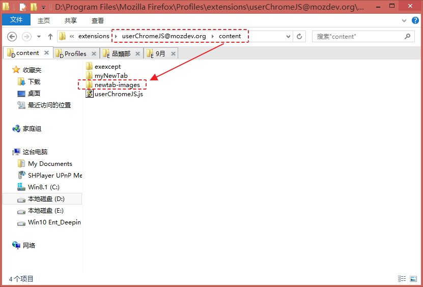
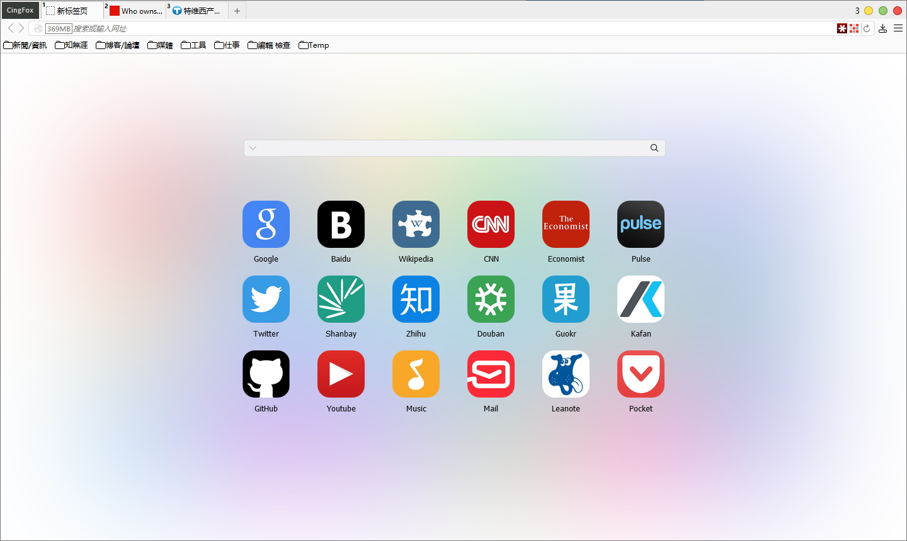

##about:newtab美化

by RunningCheese

###使用方法：
第1步、解压后，把newtab-images整个文件夹复制到content文件夹下面，如图：  

第2步、修改以下参数：

    user_pref("browser.startup.homepage", "about:newtab");//首頁
    user_pref("browser.newtabpage.columns", 6);//新标签页列数
    user_pref("browser.newtabpage.rows", 3);//新标签页行数
    //标签页固定的网站
    user_pref("browser.newtabpage.pinned", "[{\"url\":\"https://www.google.com/ncr\",\"title\":\"Google\"},{\"url\":\"http://www.baidu.com/\",\"title\":\"Baidu\"},{\"url\":\"https://www.wikipedia.org/\",\"title\":\"Wikipedia\"},{\"url\":\"http://www.cnn.com/\",\"title\":\"CNN\"},{\"url\":\"http://www.economist.com/\",\"title\":\"Economist\"},{\"url\":\"http://www.linkedin.com/today/?trk=nav_responsive_sub_nav_pulse\",\"title\":\"Pulse\"},{\"url\":\"http://twitter.com/\",\"title\":\"Twitter\"},{\"url\":\"http://www.shanbay.com/\",\"title\":\"Shanbay\"},{\"url\":\"http://www.zhihu.com/explore\",\"title\":\" Zhihu\"},{\"url\":\"http://www.douban.com/\",\"title\":\"Douban\"},{\"url\":\"http://www.guokr.com/\",\"title\":\"Guokr\"},{\"url\":\"http://bbs.kafan.cn/forum-215-1.html\",\"title\":\"Kafan\"},{\"url\":\"https://github.com/dupontjoy\",\"title\":\"GitHub\"},{\"url\":\"https://www.youtube.com/\",\"title\":\"Youtube\"},{\"url\":\"http://music.163.com/\",\"title\":\"Music\"},{\"url\":\"http://email.163.com/\",\"title\":\"Mail\"},{\"url\":\"http://leanote.com/note/\",\"title\":\"Leanote\"},{\"url\":\"https://getpocket.com/a/queue/list/\",\"title\":\"Pocket\"}]");

第3步、将UI-New Tab.css写入Stylish扩展

最終效果圖： 
