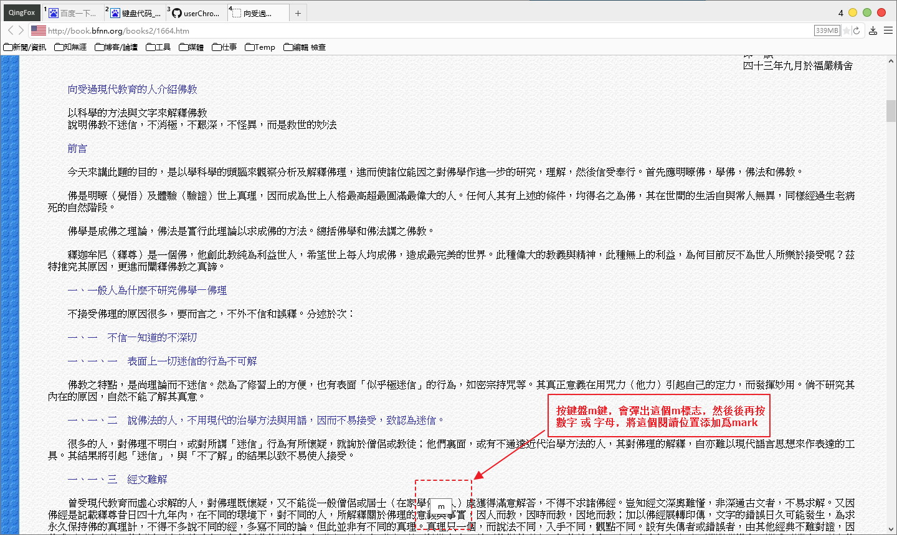
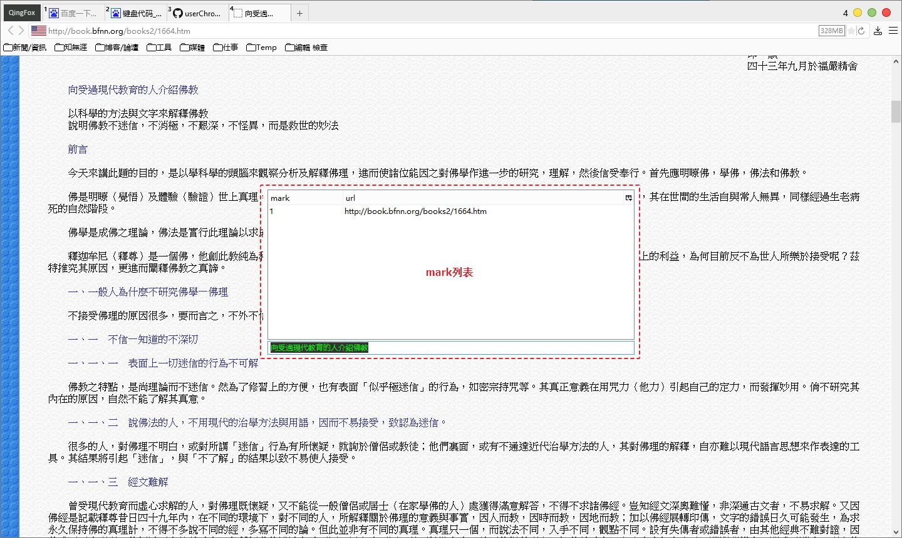

##localMark

by slimx

**通過坐標記住網頁閱讀位置**，坐標保存在prefs.js中，如：
    
    user_pref("extensions.localmark.marks", "{\"1\":[\"http://book.bfnn.org/books2/1664.htm\",{\"x\":0,\"y\":8257}]}");

相比其它的頁面標記類腳本，只能打開那個頁面，才能跳轉到指定位置；這個腳本的好處是，在任意頁面，調用已存標記（通常爲單個數字或字母），都會新標籤打開頁面，併跳到指定位置。

最早接觸這個腳本是在2011年，當時正值Firefox 3到4升級的阶段，也就是Firefox墮落之前最後的黄金時段。那時xiaoshan還有自己的主頁，上面記錄了超多他對Firefox的研究成果，非常的專業。從網站上找到了相當多有用的腳本，localmark就是其中之一。可惜後來網站宕掉，而且一直未能恢复，眞是可惜。

###操作

| | |
| :--- | :--- |
| 快捷鍵: | 說明: |
| m + 單個數字/字母 | 为網頁加書籤mark |
| ' | 跳轉到指定mark |
| \ | 調出mark列表 |
| x | 刪除列表中的選中項 |

| | |
| :--- | :--- |
|  |  |
