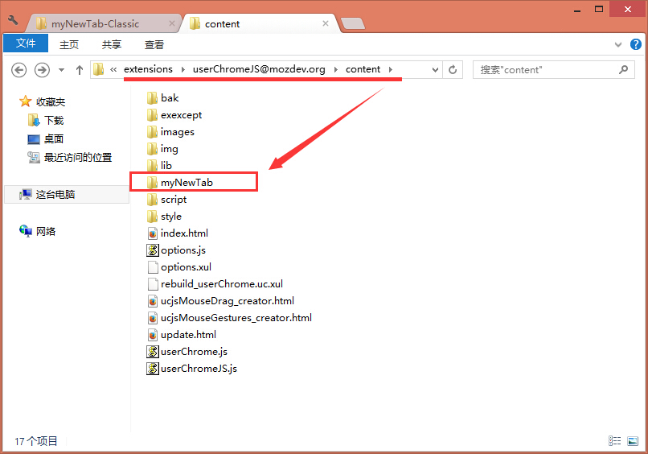
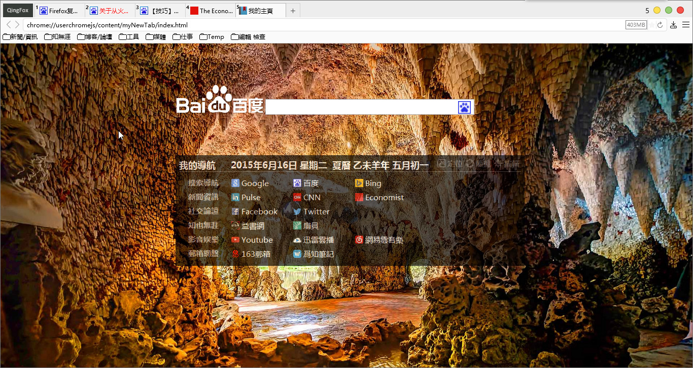

##myNewTab-Classic

**by Defpt & ywzhaiqi**

此版爲原始版，功能較單一，當然也有它的好處：

**1:** 保存下來的圖片是原文件名

**2:** 文件體積小

**3:** 個人調整：加入日曆

**4: 媽媽再也不用擔心我被升級了**

原來Favicon可以用在線形式，用了快一年才知道。。。

[**原作者發佈地址**][1]

###使用方法：

第1步、解压后，把myNewTab整个文件夹复制到『extensions\userChromeJS@mozdev.org\content』下面，如图：
 

第2步、修改这两条参数：

> user_pref("browser.startup.homepage",
> "chrome://userchromejs/content/myNewTab/index.html");//首页
> 
> user_pref("browser.newtab.url",
> "chrome://userchromejs/content/myNewTab/index.html");//本地Html

大功告成！效果图：

[1]: http://bbs.kafan.cn/thread-1759418-1-1.html

