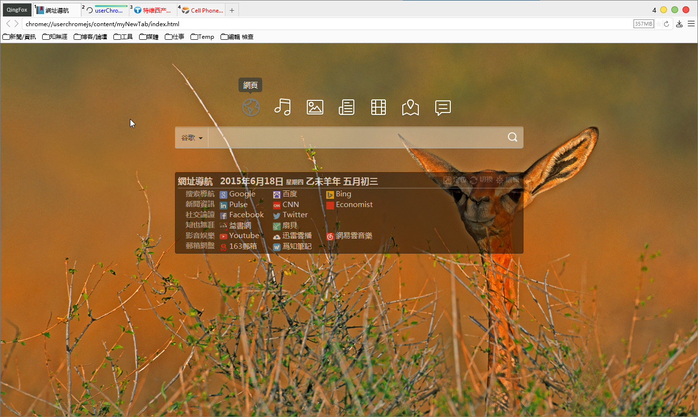

## myNewTab-Deepin
Create by **Defpt & ywzhaiqi** 
Deepin Mod by **12101111** 
Fix image download by **Cing** 
仿：http://start.linuxdeepin.com/index.zh_cn.html 
12101111兄修改仿Deepin界面，[发布页](http://bbs.kafan.cn/thread-1765402-1-1.html)。

此版爲Deepin界面版：
- 從[擴展版](xpi/)中提取
- 修复下載圖片爲0KB的問題
- **媽媽再也不用擔心我被升級了**

### 使用方法：
第1步、解压后，把myNewTab整个文件夹复制到content文件夹下面，如图：  

第2步、修改这两条参数：

    user_pref("browser.startup.homepage", "chrome://userchromejs/content/myNewTab/index.html");//首页
    user_pref("browser.newtab.url", "chrome://userchromejs/content/myNewTab/index.html");//本地Html

大功告成！效果图： 

