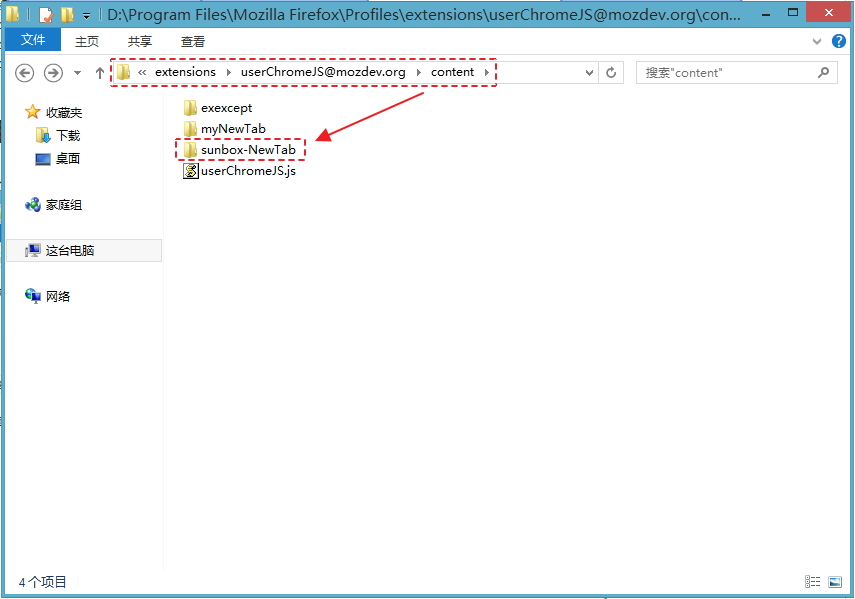
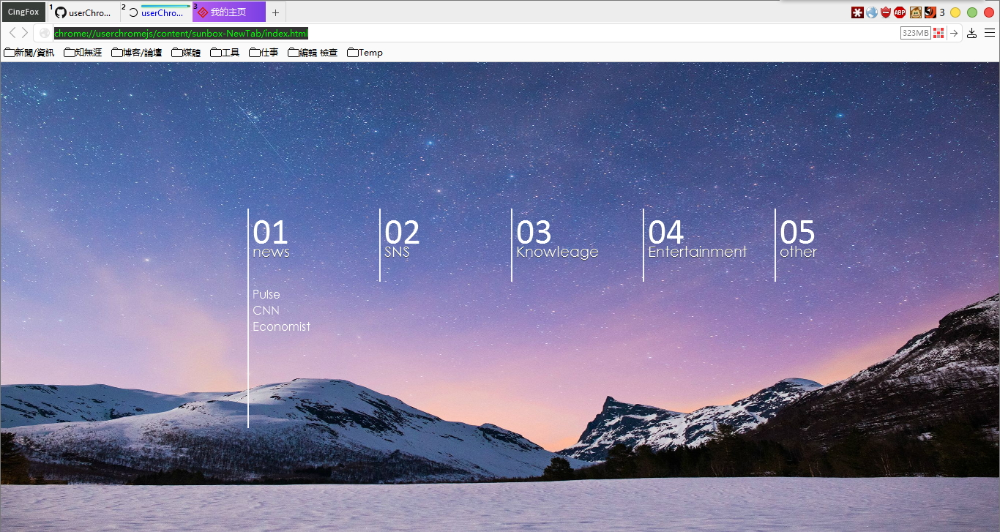

## sunbox-NewTab
by Aunsen

### 使用方法：
第1步、解压后，把myNewTab整个文件夹复制到content文件夹下面，如图：  

第2步、修改这两条参数：

    user_pref("browser.startup.homepage", "chrome://userchromejs/content/sunbox-NewTab/index.html");//首页
    user_pref("browser.newtab.url", "chrome://userchromejs/content/sunbox-NewTab/index.html");//本地Html

大功告成！效果图： 

