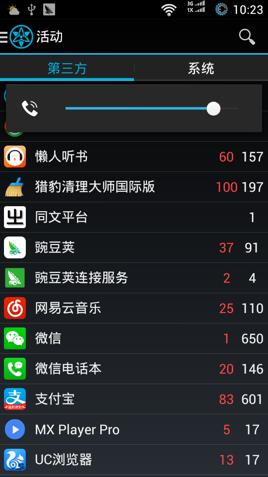

###定時逹人

功能挺多, 常用如下:

- [x] 定時關機及重啟
- [x] 定時關閉APP, 清理後台應用, 降低電量消耗
- [x] 定時更改鈴聲, 音量等

###禁用服務

禁用後台服務, 減少流量消耗及電量消耗, 可管理:

- [x] 服務

###My Android Tools (我的安卓工具)

禁用服務升級版, 同一作者出品, 可管理:

- [x] 服務
- [x] 廣播接收器
- [x] 活動
- [x] 內容提供商

###3C Toolbox

功能極其強大, 但是没有導出設置功能, 不方便使用

| | |
| :-- | :-- |
| [APP](APP/) | 程序備份 |
| [Settings](Settings/) | 設置備份 |
| 定時逹人:↓ | 禁用服務:↓ | My Android Tools:↓ |
|  |  |  |