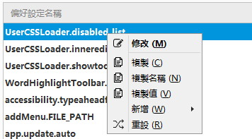

Firefox 36之後右鍵加圖標的方式有了變化，原來的方式加不上圖標, 曾經用Addmenuplus來加過，但加的圖標比CSS要延遲一些。 
直到今天（2015.07.18）終於找到方法用CSS加圖標，並解決了圖標與文字擠在一起的問題。

(1) 36版之後，新的加圖標方式需要加上这一句：

    -moz-binding:url("chrome://global/content/bindings/menu.xml#menuitem-iconic")!important;

(2) 解決图標和文字擠一起問題：

    /*==修正图標和文字擠一起問題==*/
    /* Adjust left-margin for menuitems and menus which aren't iconized */
    menuitem:not([type="checkbox"]):not([type="radio"]) > hbox.menu-iconic-left, menu > hbox.menu-iconic-left 
    {-moz-appearance:menuimage;}
    
現在把平時會看到的地方都補上圖標：

| | |
| :--- | :--- |
| 地址欄右鍵菜單: | 歷史右鍵菜單: |
|  |  |
| About:Config右鍵菜單: | Dom Inspector右鍵菜單: |
|  |  |

[CSS地址](https://github.com/dupontjoy/userChromeJS/raw/master/UserCSSLoader/02-%E5%BE%AE%E8%AA%BF-03%E2%80%94%E2%80%94%E5%9C%96%E6%A8%99%20%E7%BE%8E%E5%8C%96.css)