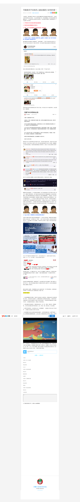

- [x] 2016.05.09更新规则

Need to set qpic.cn or qlogo.cn refer as @Block first, then the following 2 methods will work.

    'qpic': '@BLOCK',
    'qlogo': '@BLOCK',

Enable weixin image from 3-party sites: set src the same with data-src

    Weixun_Image.user.js

Another way with Redirector:

    {
      //example: http://ding.youku.com/a/id_XMTY2NDYw.html
      //方法來源: http://bbs.csdn.net/topics/391051571
      name: "微信圖片 反盜鏈",
      from: /^https?:\/\/mmbiz\.(qpic|qlogo)\.cn\/mmbiz\/(.*)\/(.*)\?wx_fmt=(.*)/i,
      to: "http://mmbiz.qpic.cn/mmbiz/$2/640",
      regex: true
    },

Page screenshot with all the weixin images loaded:

