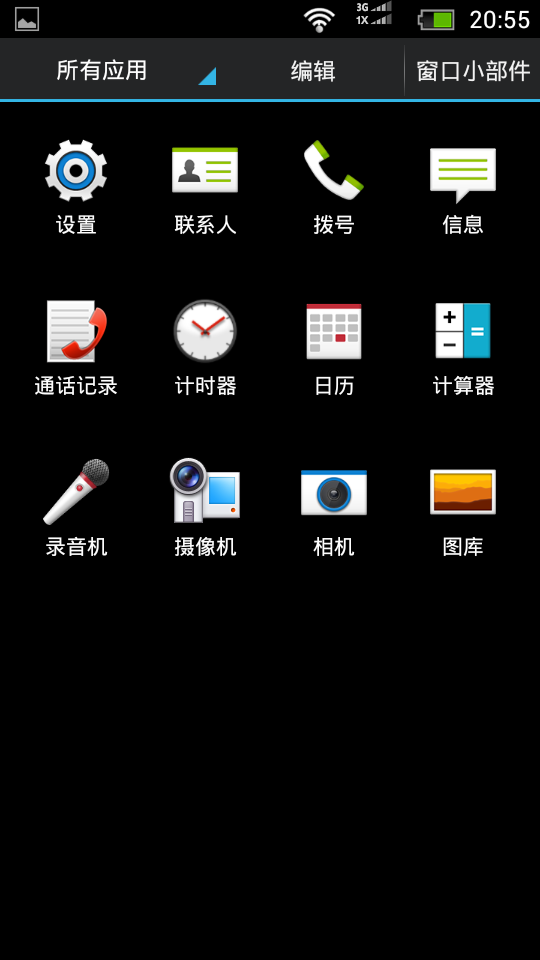
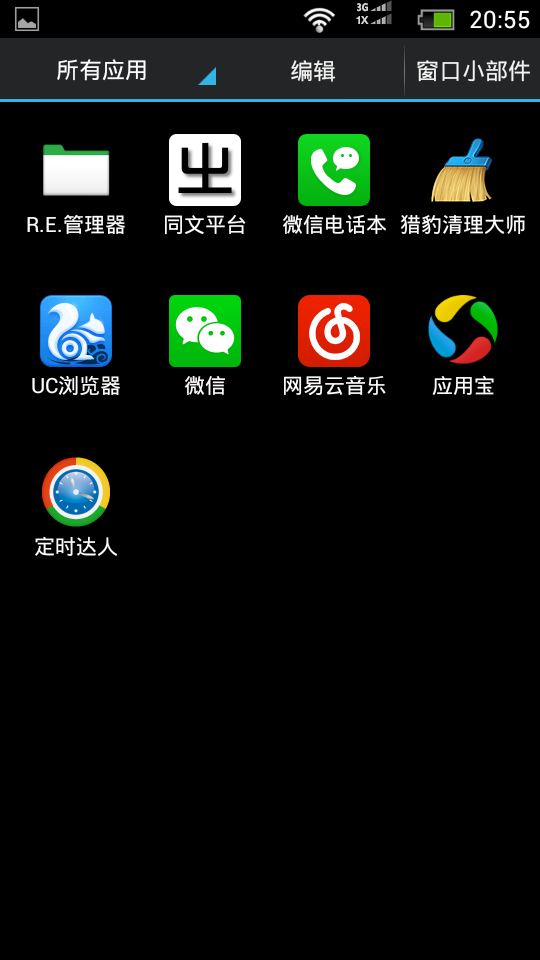
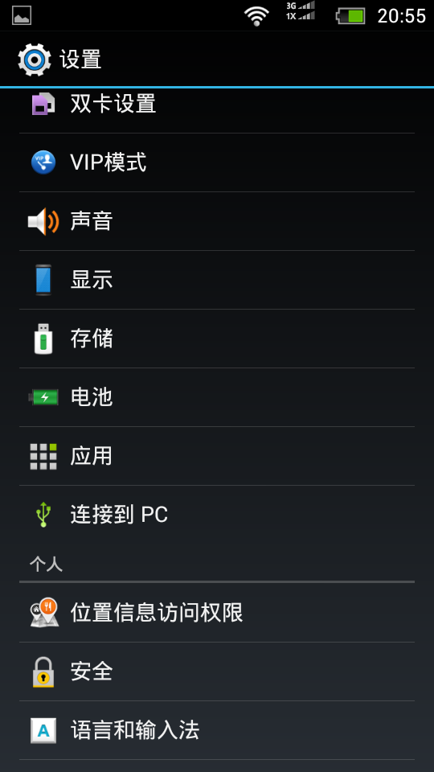

##HTC N980 刷機包

by 小Yu

####ROM簡介

| | |
| :--- | :--- |
| ROM名称 | ZTE N980 仿HTC风格美化 |
| Android版本 | 4.1.2 |
| 基于版本 |  N980V1.0.0B08 |
| 适配机型 | ZTE N980 |
| ROM制作者 | 小Yu |
| 发布时间 | 2014.10.12 |
| | |
| 原貼 | http://www.in189.com/thread-1042285-1-1.html |
| 原始下載(130M) | http://pan.baidu.com/s/1o6G6mYu |
| 再精簡下載(120M) | https://yunpan.cn/cuP7HfMKWakL2#8c50 |

####ROM特性

- 完美root权限;
- 精简部分无用软件;
- 精简多余lib库文件;
- 精简自带壁纸;
- ROM体积精简到130M;
- 仿HTC美化;
- 更换开机动画为Google动画;
- 抽屉背景透明，显示壁纸;
- 网络，网速优化;
- 默认开启未知来源，USB调试等;
- 默认关闭自动旋转，GPS，拨号盘触摸音效，触摸提示音，锁屏提示音等;
- 默认最低亮度;
- 去除了谷歌框架，空闲更多的可用内存;
- 省电增强;
- 去除照相声音与开机铃声;
- 替换自带输入法为百度输入法;
- 加入原生归属地;
- 加入RE管理器;
- 桌面、抽屉重新排版;
- 内置实用软件： 释放内存 百度输入法;
- 其他优化请大家刷入后体验!
 
####再精簡

- 精簡百度輸入法;
- 精簡部分無用的內置APP

####注意事項

- 此ROM为卡刷包，下载后放入SD卡根目录，进入recovery，按照刷机教程即可刷入！
- 刷前勿必双清, 可能的话三清

####ROM截圖

(注: 截圖中的應用並不包含在ROM内; 自帶應用與個人安裝應用的圖標完全是兩個風格, 很好區分.)

| | | |
| :--- | :--- | :--- |
|  |  |  |
|  |  | |
